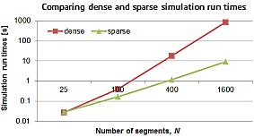

We are delighted to announce that **Dymola 2018 FD01 was released on December 1, 2017**.

#### Modeling and simulation

To improve simulation performance, the numeric solvers have been improved for large models
with sparse structure, e.g. electrical transmission lines. For appropriate model structures
up to 100x faster simulation can be achieved.

Dymola 2018 FD01 has been enhanced with convenient tools to check what events are generated
during simulation and plot hot spots of execution. This helps the user to find simulation
bottlenecks and prepare models for real-time simulation.

Flexible and natural handling of units on input allows the user to type expressions such as
"47 pF" directly. Dymola detects unit and prefix and applies appropriate scaling to SI units.

#### New Modelica libraries

Several new Modelica libraries are introduced in Dymola 2018 FD01, providing a wide range
of solutions from hydraulic systems to advanced power plants.
- Fluid Power – hydraulic systems
- Electric Power Systems – AC and DC including high frequency AC 
- Hydrogen – fuel cell applications
- ClaRa Plus – advanced power plants
- Fluid Dynamics – estimate human comfort within an air-conditioned zone
- Testing – framework to build test models and create reference results
