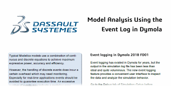

Dassault Systèmes offers [free webinars, whitepapers and tools](https://www.3ds.com/products-services/catia/products/dymola/free-downloads/) for the Modelica and FMI communities.

#### Webinars

**An introduction to Dymola**
- Learn how the power of Dymola and Modelica can drive the efficient modeling,
simulation and validation of multi-domain dynamic systems to rapidly solve
complex modeling and analysis problems.

**MBSE with Modelica and Dymola**
- Optimize systems development - from conceptual studies through to detailed
HIL validation. Model-based system engineering is essential to speed the development
of complex, multi-domain systems.

**Building models with Dymola**
- Watch this webinar to discover how the power of Modelica and Dymola can be used
to quickly model, configure, simulate and validate the many different systems in a
hybrid electric vehicle, for example, to evaluate the impact of different control
system strategies.

#### Whitepapers

Dive into some of the powerful features of Dymola with these easily accessible papers,
written by our Dymola, Modelica and FMI experts. Topics covered include model debugging,
performance, tips and tricks.
- Dymola Referential (a technical overview and summary of benefits of Dymola, Modelica, and FMI)
- Dymola Sparse Solvers for Large-Scale Simulations
- Model Analysis Using the Event Log in Dymola
- Analyzing Numeric Integration
- Migrating from Modelica 2 to Modelica 3

#### Tools and Libraries

**FMU Simulator** is a standalone Windows app that lets you inspect, validate and test
Functional Mockup Units (FMUs). It supports FMI 1.0 and 2.0 for both model exchange
and co-simulation as well file based input and output. With its easy to use interface
it’s an essential for every developer working with FMUs.

**FMPy Library** is a Python library to simulate Functional Mockup Units (FMUs).
It supports FMI 1.0 and 2.0 for both model exchange and co-simulation and runs
on Windows and Linux.

The **Modelica Arduino library** lets you simulate your circuits and sketches on a
virtual Arduino Uno without the need for hardware, a lab and soldering.
