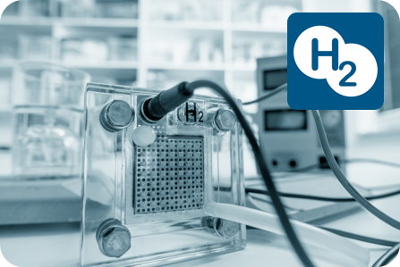

{:width="70%"}

The Hydrogen library is targeted at modeling and simulation of PEM fuel cell stacks and
fuel cell systems using hydrogen and air. It may be used for pre-design, control strategy
evaluation, or loss analysis. The library contains models for membranes and complete stacks
as well as auxiliary components, e.g. compressors and valves.
Due to the generic equivalent circuit approach, only the data sheet with a polarization curve
is needed for the parameterization of the membrane models. A tutorial helps the user to
adapt the stack templates to his/her fuel cell type.

This picture shows one of the example models, a controlled  compressor provides
the stack with a sufficient high air flow such that the preset air ratio lambda can be kept even if the desired current changes.
