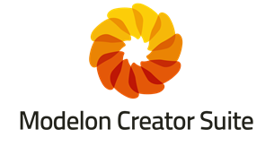

Modelon is pleased to announce the release of 2018.1 for products within the [Modelon Library Suite](http://www.modelon.com/products/modelon-library-suite/), [Modelon Creator Suite](http://www.modelon.com/products/modelon-creator-suite/), and [Modelon Deployment Suite](http://www.modelon.com/products/modelon-deployment-suite/). Detailed release notes are available and can be found on the individual product pages as well as clicking the links below.&nbsp; 

As part of our multi-platform strategy Modelon libraries are compliant in Dymola, OPTIMICA, Simplorer, IGNITE, and MapleSim. 

Updated versions of Modelon products are only sold and distributed directly from Modelon, as well as approved [resellers](http://www.modelon.com/about-modelon/contact/resellers/).  [Contact us directly](http://www.modelon.com/about-modelon/contact/sales-and-inquiries/) to update your Modelon software! 

2018.1 includes updates to the following libraries within the Modelon Library Suite:

- [Air Conditioning Library v1.16](http://www.modelon.com/products/modelon-library-suite/air-conditioning-library/air-conditioning-library-release-information/)
- [Electric Power Library v2.4](http://www.modelon.com/products/modelon-library-suite/electric-power-library/electric-power-library-release-information/)
- [Engine Dynamics Library v2.1](http://www.modelon.com/products/modelon-library-suite/engine-dynamics-library/engine-dynamics-library-release-information/)
- [Environmental Control Library v3.4](http://www.modelon.com/products/modelon-library-suite/environmental-control-library/environmental-control-library-release-information/)
- [Fuel Cell Library v1.7](http://www.modelon.com/products/modelon-library-suite/fuel-cell-library-release-information/)
- [Fuel System Library v4.3](http://www.modelon.com/products/modelon-library-suite/fuel-system-library/fuel-system-library-release-information/)
- [Heat Exchanger Library v2.1](http://www.modelon.com/products/modelon-library-suite/heat-exchanger-library/heat-exchanger-library-release-information/)
- [Hydraulics Library v4.8](http://www.modelon.com/products/modelon-library-suite/hydraulics-library-release-information/)
- [Hydro Power Library v2.7](http://www.modelon.com/products/modelon-library-suite/hydro-power-library/hydro-power-library-release-information/)
- [Liquid Cooling Library v2.1](http://www.modelon.com/products/modelon-library-suite/liquid-cooling-library/liquid-cooling-library-release-information/)
- [Pneumatics Library v2.4](http://www.modelon.com/products/modelon-library-suite/pneumatics-library-release-information/)
- [Thermal Power Library v1.16](http://www.modelon.com/products/modelon-library-suite/thermal-power-library-release-information/)
- [Vapor Cycle Library v2.1](http://www.modelon.com/products/modelon-library-suite/vapor-cycle-library/vapor-cycle-library-release-information/)
- [Vehicle Dynamics Library v3.1](http://www.modelon.com/products/modelon-library-suite/vehicle-dynamics-library-release-information/)

2018.1 includes updates to the following products within the Modelon Creator Suite:
- [OPTIMICA Compiler Toolkit v1.2](http://www.modelon.com/products/optimica-compiler-toolkit-release-information/)
- [JModelica 2.2](http://www.jmodelica.org/)

2018.1 includes updates to the following product within the Modelon Deployment Suite:
- [FMI Toolbox v2.6.3](http://www.modelon.com/products/modelon-deployment-suite/fmit-toolbox-for-matlabsimulink-release-information/)

<h4><a href="http://www.modelon.com/about-modelon/contact/sales-and-inquiries/" title="Opens internal link in current window" class="internal-link">Contact us to receive 2018.1 updates!</a></h4>

<a href="http://web.modelon.com/cn/aavt4/subscribe-newsletter" title="Opens external link in new window" target="_blank" class="external-link-new-window">Subscribe to our mailing list&nbsp;</a>to receive future information about product releases in your inbox.
