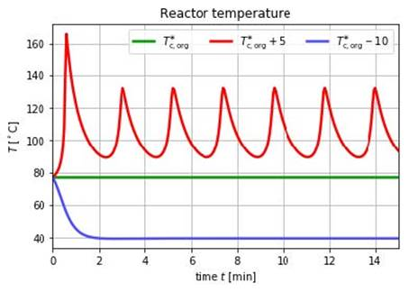

Julia and Matlab scripting interfaces have been introduced to the OpenModelica tool suite [see](https://www.openmodelica.org/) 
called OMJulia and OMMatlab.[see](https://www.openmodelica.org/doc/OpenModelicaUsersGuide/latest/)

Simulation of a Seborg chemical process reactor
 
The OMJulia and OMMatlab scripting modules are available in the OpenModelica 1.13.0 Beta1 release and later releases. Below some highlights are briefly mentioned.:

- Access to the whole OpenModelica scripting API
- Loading, compiling, and simulating models
- Operations on models such as linearization.
- Loading simulation results for analysis, plotting, etc.
- Parameter sweeps, e.g. for optimization and/or sensitivity analysis.
- Control design when used together with appropriate Julia or Matlab packages.