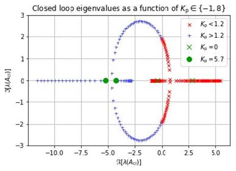
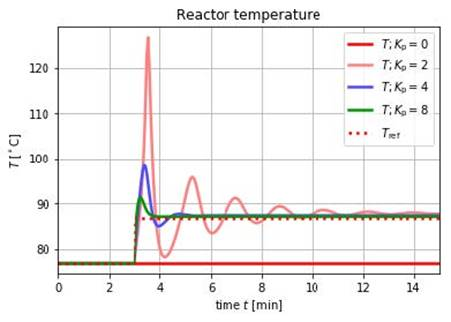

OMPython is the Python scripting interface to the OpenModelica tool suite [see](https://www.openmodelica.org/)
An Enhanced OMPython version has recently been developed, making it possible to perform control design,
model linearization, sensitivity analysis, etc. [see](https://www.openmodelica.org/doc/OpenModelicaUsersGuide/latest/ompython.html#enhanced-ompython-features)

Investigating closed loop eigenvalues

Simulation of a Seborg chemical process reactor controlled by a PI controller
 
The enhanced OMPython is available in the OpenModelica 1.12.0 final release and later releases. Below some highlights are briefly mentioned.:

- Access to the whole OpenModelica scripting API
- Loading, compiling, and simulating models
- Operations on models such as linearization.
- Loading simulation results for analysis, plotting, etc.
- Parameter sweeps, e.g. sensitivity analysis.
- Control design.