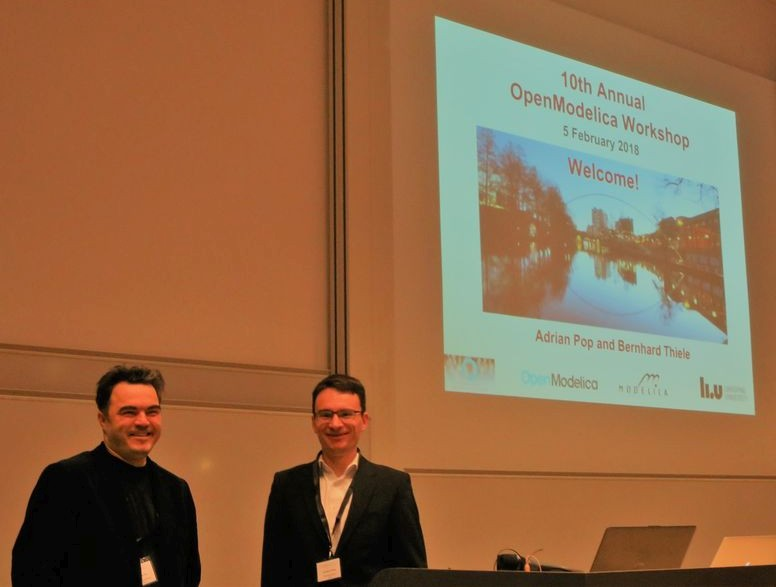
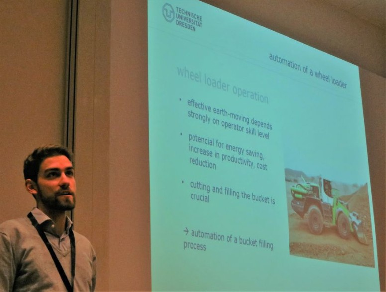

The 10th OpenModelica Annual Workshop organized by the Open Source Modelica Consortium
was held successfully in Linköping, Sweden, on February 5, 2018.New results and applications regarding the OpenModelica
platform were presented, including design of a test automation system, simulation of mobile machinery,
a standardized interface between the C and C++ runtime, a Hydropower Modelica library, parallel large-scale
optimization and internet-of-things for cyber-physical systems, homotopy-based initialization,
DAE-model for solving large systems, co-simulation using OMSimulator, equation-based model reduction,
using Python API for controlling non-linear reactor models.

The program and the 13 presentations are available from: [link](https://www.openmodelica.org/events/openmodelica-workshop/openmodelica-program-2018)

|  |  |
| Adrian Pop and Bernhard Thiele, OpenModelica workshop chairpersons (Linköping University) opening the workshop. | OpenModelica workshop, Volker Waurich presenting automation of a wheel loader (TU Dresden). | {:style="table-layout:fixed;"}
