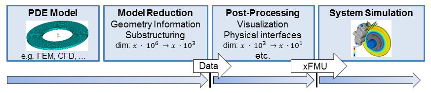

A new project proposal called PDE (partial differential equations) for Systems initiated at the last Modelica Design Meeting addresses the utilization of reduced order models originating from semi-discretized PDE (such as finite difference/element/volume models) from various physical domains  in system simulations in a standardized, tool-independent way. This includes the definition of non-proprietary standard formats to export data from associated tools but also aims to specify a standardized, extended Functional Mock-up Interface (xFMI) component as shown in the workflow instance below. The goal is to organize model-exchange and co-simulation of reduced order PDE-models in system simulation and represent cyber-physical systems with relevant distributed properties this way. 

The project is supposed to be driven by a collection of use cases which in particular demonstrate the added value of such a standardized interface component and attract industry and commercial PDE-tool vendors.  Everyone who feels appealed by the project idea is strongly requested to submit use case candidates similar to the use case Health Monitoring of Composite to the repository, preferably by 1. June 2018.

Contact: Dr. Andreas Heckmann, DLR, Institute of System Dynamics and Control, andreas.heckmann@dlr.de 
