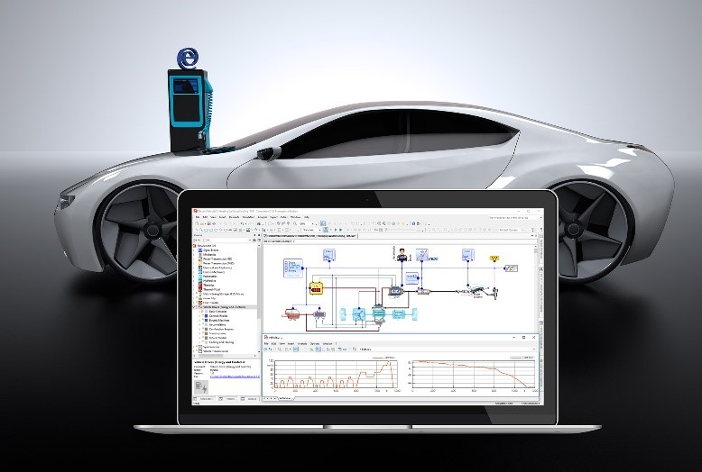

SimulationX 3.9 comes with a multitude of new features and libraries both for Modelica® experts and for those new to the Modelica world, enabling an easy access to system simulation.

New navigation aids and filters for the model structure facilitate even experienced simulation engineers in dealing with large and complex model structures. Starting from this version, a Simulation Task Manager with extensive functionalities is available for automated series calculations. New and expanded model libraries accelerate development and design processes, particularly in the areas of design, development and virtual testing of electric vehicles and belt conveyors, including a novel model generator. The model range has also been expanded with new vibration dampers for vibration analysis of drive trains.

Furthermore, version 3.9 supports Modelica State Machines as well as efficiently integrating clocked signals into the system model, using the Modelica Synchronous technology. 
For more information visit [www.simulationx.com/3-9 ](https://www.simulationx.com/3-9)
