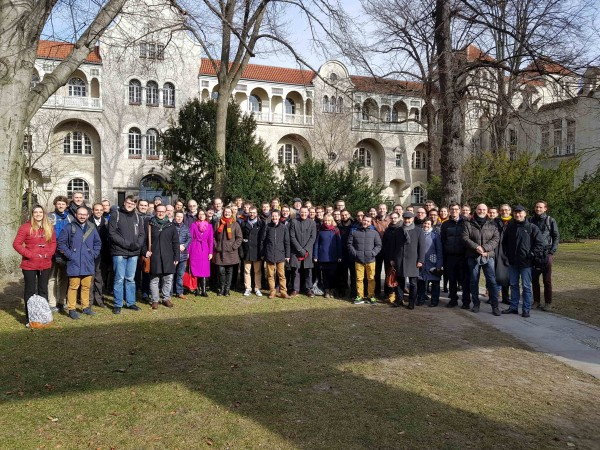

On February 27 and 28, 2018, the IBPSA Project 1 held its first Expert Meeting at the UdK Berlin, hosted by Christoph Nytsch-Geusen.
The meeting was attended by 60 people. The main focus of meeting was to organize collaborative work
to be conducted during the 5 year project duration.
There was also a well received keynote by Hubertus Tummescheit,
Chief Strategy Officer and co-founder of Modelon,
about "The Adoption of MPC in the Power Industry – Lessons Learned and Ideas for the Buildings Industry".

{:width="250px"}

During the meeting, work was prioritized for work packages ranging
from 
* a Modelica library for design and operation, e.g., the [Modelica IBPSA Library](https://github.com/ibpsa/modelica-ibpsa),
* a Modelica library and an FMI-based platform to compare the performance of Model Predictive Control algorithms for buildings called BOPTEST,
* data representation and mapping tools for urban energy simulation workflows,
* a tool chain for Building Information Modeling (BIM) to Modelica translation,
* applications that demonstrate the developed technologies, and
* a validation test procedure called DESTEST for the validation of district energy models.

The next meeting will be in fall in Paris, organized by Engie.

For more information about the project, visit https://ibpsa.github.io/project1/index.html
