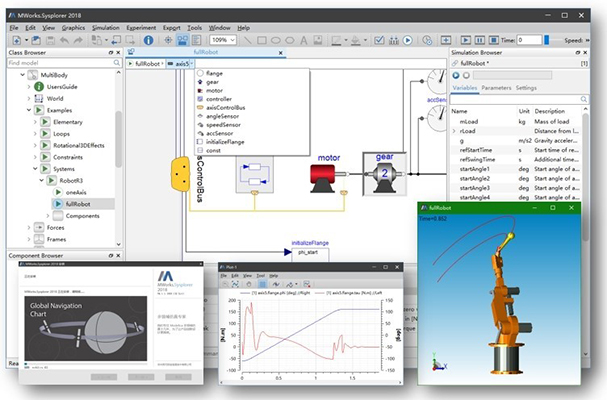
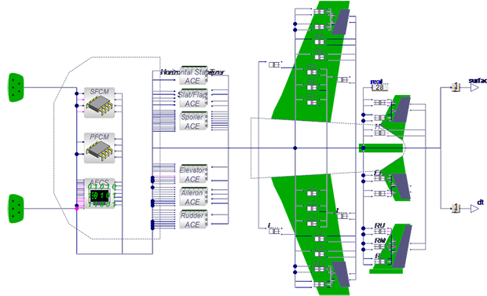
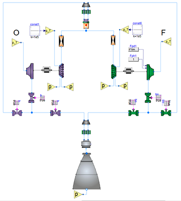

MWorks has evolved into a product suite, including system simulation software
**MWorks.Sysplorer** (original MWorks), system architecture design software
**MWorks.Sysbuilder**, and model collaboration and management software
**MWorks.Syslink**. MWorks.Sysplorer 2018 is now being launched after rebuilding for
two years.

#### MWorks.Sysplorer 2018
- Fully supports Modelica language specification 3.4 and Modelica standard library 3.2.1,
and is compatible with 2.x version.
- Provides full supports for FMI 1.0 and FMI 2.0, including the export and import of the
Model-Exchange mode, as well as the slave export and import of the Co-Simulation
mode.
- Supports collaborative modeling based on MWorks.Syslink, providing unified model
management and collaborative services, including downloading, updating, submitting,
and publishing.
- Provides a new UI appearance and the solver performance is greatly improved.
- Export models to NI Veristand and Matlab S-Function, and the distributed display
function is provided.

#### Tongyuan Aircraft Dynamics Library
The library supports system-level rapid modeling and simulation of a wide range of flight
vehicles. The library provides 6-DOF aircraft model, aerodynamic calculation model,
basic components that constitute the flight control law, and the necessary components to
complete the closed loop of the aircraft system, also provides the hardware interface for
the operating devices. The library can be applied to the rapid construction of aircraft
system model, verification of control laws, desktop simulation and real-time simulation of
human in the loop.

#### Tongyuan Liquid Rocket Engine Library
The Liquid Rocket Engine library covers the component models required for simulation of
liquid rocket engine system, including turbo pumps, various types of pipes, valves,
throttle elements, combustor components, and sources. The user can quickly build a
system model based on the physical topology of the liquid power system, the main state
parameters of the engine in the process of starting, adjusting and shutdown can be
studied by simulation.
