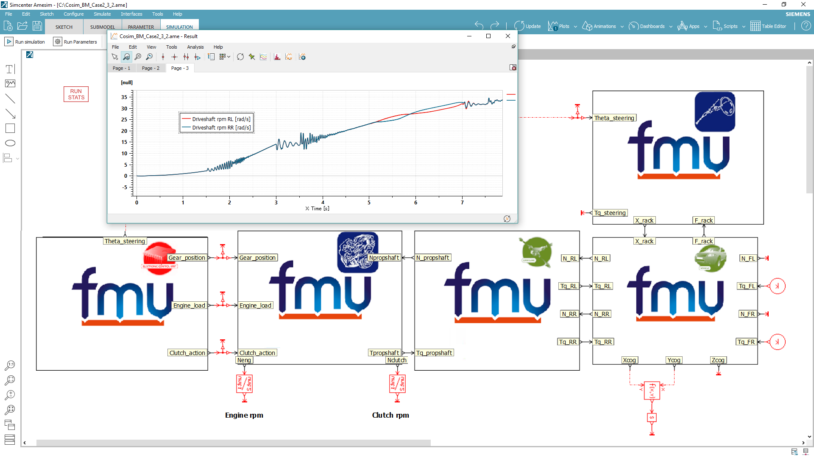

With the addition of FMI 2.0 for model exchange import and export, 
**the recently released Simcenter Amesim 16 supports all existing continuous and discrete coupling modes of FMI**. 
Moreover all Simcenter Amesim 2.0 FMUs can provide their directional derivatives. 
As a result, Simcenter Amesim's recognized frequency analysis capabilities become available 
within advanced FMI master or importing environments. These high-end FMI capabilities 
make Simcenter Amesim one of the most interoperable system simulation tools and reflect 
Siemens PLM Software's expertise and prominent role within the FMI Steering Committee. 

For its forthcoming product releases, Siemens PLM Software is working on other advanced FMI capabilities that pave the way towards large-scale and efficient heterogeneous simulations. 

#### Support for FMI compatible real-time targets
With Simcenter Amesim 16, users can create and export real-time capable models directly as FMUs
specifically generated for compatible real-time targets. Supported hardware currently includes:

- dSPACE SCALEXIO
- ETAS LABCAR (32-bit and 64-bit)
- Concurrent Simulation Workbench (32-bit and 64-bit)

More will come, along with **the support of tunable parameters for online or virtual calibration**.
For more information on Simcenter Amesim, please visit our [website](www.siemens.com/plm/simcenter-amesim ).
