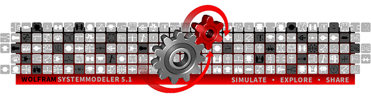

We are pleased to announce the release of Wolfram SystemModeler 5.1.

SystemModeler 5.1 focuses on maximizing the usage you get from your models. Create models that are user friendly and let others analyze and explore them or deploy them onto a physical system.

Some key features include:
- New standardized export with FMI for co-simulation. Make your models potentially usable anywhere, by anyone.
- Ready your models for exploration and analysis with new tools to develop high-quality, flexible and easy-to-share models.
- Deploy to millions of Wolfram Language users with the new built-in system modeling functionality

Read more about the release here 
[blog.wolfram.com/2018/03/21/unleash-your-models-with-systemmodeler-5-1](http://blog.wolfram.com/2018/03/21/unleash-your-models-with-systemmodeler-5-1/)

For more details and the latest news, visit [wolfram.com/system-modeler/what-is-new](http://www.wolfram.com/system-modeler/what-is-new)
