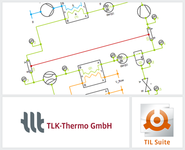

{::options parse_block_html="true" /}

The TIL Suite enables stationary and transient simulations. The current **version 3.5.0** includes numerous new and improved components and system models. Among other things, we would like to draw your attention to the following innovations:
- Using the gas components, air pathways and systems can be simulated with ideal gases and mixtures, taking **condensation and ice formation** into account.
- The optimization of the VLE fluid components (vapor-liquid-equilibrium) enables more robust simulations of **refrigerant circuits, heat pumps** or other systems with working fluids.
- With the aid of new and optimized liquid components (hydraulic inductor and compensation tanks), **cooling circuits** and **hydraulic systems** can be calculated much faster and more stable.
- Completely revised and clearly extended documentation.

For further information see [www.tlk-thermo.com](https://www.tlk-thermo.com/index.php/en/software-products/til-suite), [download the TIL presentation](https://www.tlk-thermo.com/images/tlk/content/presentations/TIL_Suite_presentation.pdf) or contact us at [til@tlk-thermo.com](mailto:til@tlk-thermo.com).
