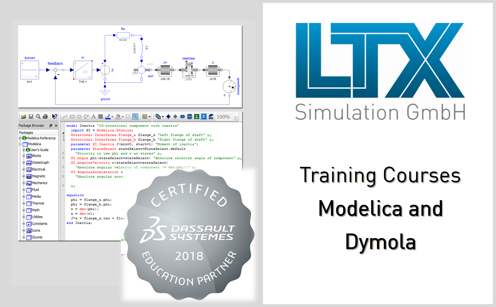

In the upcoming months, LTX Simulation GmbH offers the following 2-day training classes for Dymola and Modelica in German language (in English on request) at our office in Munich:

[Multi-domain modeling and simulation with Modelica and Dymola](http://www.ltx.de/download/Kurs_ModelicaDymola_LTXSimulation.pdf) (Prof. Martin Otter)  
April 24 – 25, 2018

[Introduction to Dymola and Modelica](http://www.ltx.de/download/Kurs_EinfuehrungDymolaModelica_LTXSimulation.pdf) (Leo Gall)  
July 02 – 03, 2018

[DLR Visualization Library and Modelica MultiBody](http://www.ltx.de/download/Kurs_VisualizationMultiBody_LTXSimulation.pdf) (Dr. Tobias Bellmann)  
Autumn 2018, please contact us for next date 

We also offer in-house classes in German or English on request.
If you are interested in special topics for your training (e.g. Model Calibration, OpenModelica, Modelica Synchronous State Machines), please contact us.

Please visit [our website](http://kurse.ltx.de) for more information or contact us at [kurse@ltx.de](mailto:kurse@ltx.de). 
