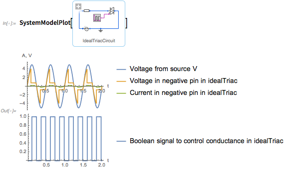

Version 11.3 of the Wolfram Language and Mathematica have just been released, with nearly 120 completely new functions. This includes built-in support for simulating and analyzing Modelica models, with the full simulation core of SystemModeler now available to all Wolfram Language users.

The system modeling functionality in the Wolfram Language makes it very easy to accomplish tasks such as:
- Analyzing problems in and the performance of systems, e.g. [vibration analysis of a printing press](https://www.wolfram.com/system-modeler/examples/industrial-manufacturing/configuration-analysis-cylinders.html)
- Designing and optimizing aspects of a system, e.g. [design of an aircraft autopilot](https://www.wolfram.com/system-modeler/examples/aerospace-defense/aircraft-dynamics-design-simulation.html)
- Exploring and investigating different scenarios, e.g. [studying the spread of sickle cell anemia](http://blog.wolfram.com/data/uploads/2018/03/Natural-Selection-with-Wolfram-SystemModeler.nb)

[Click here](http://www.wolfram.com/system-modeler/what-is-new/?popup=system-modeling-in-the-wolfram-language) to see a video of the new functionality in action, or [click here](http://blog.wolfram.com/2018/03/08/roaring-into-2018-with-another-big-release-launching-version-11-3-of-the-wolfram-language-mathematica/) to read more about what is new in the latest version.