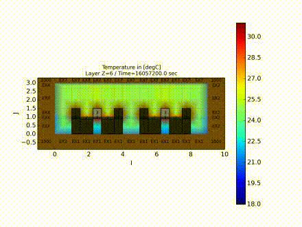

{:width="620px"}

The **FluidDynamics** library is created for **Computational Fluid Dynamics** (CFD) simulations using Modelica language. The coarse grid model of the library allowing up to 2000 cells uses common CFD equations, but the model is written entirely in Modelica language.
The flow is predicted purely by the outer boundary conditons, internal stresses and gravitation. Thus, it has the great advantage, that users must not know the flow pattern in an air-conditoned space.

{:width="440px"}

#### User Benefits
- **Faster execution time** than conventional CFD
- **Less software costs** since no middleware between CFD and Modelica tool required
- **Faster project execution** since conceptual tasks can be performed with the coarse grid
- **Full insight** into code through open-source Modelica implementation

The library is available for **Dymola 2018 FD01**. Grid generation and postprocessing is performed with **XRG Score** included in the package. It can be used for automotive, aeronautical, buildings and other HVAC applications.
