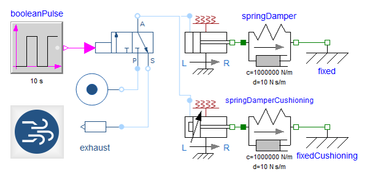

Dymola 2019 was released on June 1, 2018. Detailed information can be found [here](https://www.3ds.com/fileadmin/PRODUCTS/CATIA/DYMOLA/PDF/Dymola-2019-highlights.pdf) and the complete release notes [here](https://www.3ds.com/fileadmin/PRODUCTS/CATIA/DYMOLA/PDF/Dymola-2019-release-notes.pdf).

####Model creation

Dymola 2019 allows you to capture the parameters of existing components to create new models. This encourages the creation of specialized component libraries that can be used in subsequent designs.
Improved use of display units for parameters and variables in the graphical editor and in plots improves readability and reduces model ambiguity.

####Simulation

To further support the simulation of hard thermo-fluid problems, Dymola 2019 has more robust and efficient handling of models with nonlinear equation systems through improved handling of initial values. Improved diagnostics at compilation and runtime helps find difficult numeric problems, and intermediate values can be checked during debugging.
Optimized handling of parameters helps minimize code generation for large tables of data, leading to faster model translation, simulation and post-processing.

####Modelica libraries

Our libraries have seen the following enhancements: 

- Battery Library: Version 2.1 includes a new pack model that enables the simulation of nested cylindrical cells. Additionally, the thermal model of the cylindrical cells is updated, allowing multiple surface heat ports for an improved simulation of heat distribution in discretized pack models.
- Hydrogen Library: Version 1.1 includes new media and component models for humidity control as well as a control based methane reformation model for PEM. 
- Pneumatic Systems library is available in Dymola 2019, facilitating architecture design, component sizing, modeling and simulation of pneumatic systems. 
- Testing Library: This release brings improved test runners, changes the visual look of the library and introduces operator records.

