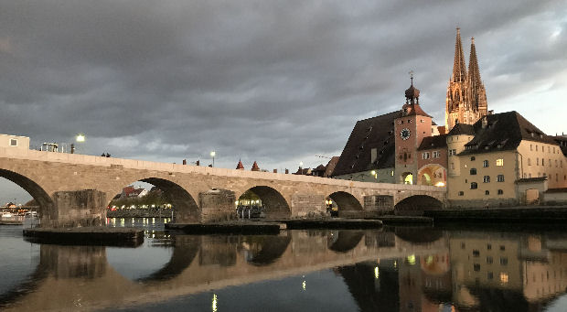

The **13th International Modelica Conference** will be held at **OTH Regensburg, Germany, March 4-6, 2019**. 
It is organized by OTH Regensburg / Faculty of Electrical Engineering and Information Technology, in cooperation with the Modelica Association.

#### Conference Venue
The conference will take place at Ostbayerische Technische Hochschule (Eastbavarian Technical University) Regensburg near the center of Regensburg, 
only 30 minutes to walk from the historical centre of Regensburg.    
**Venue Address**: OTH Regensburg    
Seybothstr. 2, 93053 Regensburg, Germany

The **Modelica Conference** is the main event for users, library developers, tool vendors and language designers to share their knowledge 
and learn about the latest scientific and industrial progress related to Modelica and to the Functional Mockup Interface.
The program will cover modeling of complex physical and cyber-physical systems, as well as tools, for a wide range of research and industrial applications. 
In addition to paper presentations and poster sessions, the conference features several Modelica tutorials for beginners and advanced users, as well as vendor presentations, and an exhibition. 
The previous Modelica conference in 2017 in Prague, Czech Republic, was attended by more than 400 participants from all over the world, 
and we would like to welcome even more participants to this conference.

#### Topics:
- Multi-engineering modeling and simulation with free and commercial Modelica libraries (mechanics, electrical, hydraulics, thermal, fluid, media, chemical, building, automotive, aircraft, ...)
- Automotive applications
- Thermodynamic and energy systems applications
- Mechatronics and robotics applications
- Medicine and biology applications
- Other industrial applications, such as electric drives, power systems, aerospace, etc.
- Large-scale system modelling
- Real-time and hardware-in-the-loop simulation
- Simulation and code generation for embedded control systems
- Simulation acceleration by use of many CPU cores or GPU cores
- Applications of Modelica for optimization and optimal control
- Modelica modeling, simulation and design tools
- Symbolic algorithms and numerical methods for model transformation and simulation
- Discrete modeling techniques - FEM, CFD, DEM (Discrete Element Method), ...
- New features of the Modelica language and of FMI
- Experimental language designs and implementations related to Modelica
- Modelica in other application areas (mathematical programming, databases etc.)
- Modelica for teaching and education
- FMI in Modelica and non-Modelica applications and tools

#### Important Dates
- Jul.30, 2018: Call for Papers
- Nov. 5, 2018: Submission of papers, libraries and vendor presentations
- Dec. 3, 2018: Notification of paper acceptance
- Jan. 7, 2019: Early registration deadline
- Jan.14, 2019: Submission of final papers and libraries, Exhibitor application
- Feb.25, 2019: Late registration deadline
- Mar. 4, 2019: Tutorials (afternoon)
- Mar. 5, 2019: Conference Dinner (evening) at the castle of Emmeram

#### Conference Fees
- Standard Early: Euro 600
- Standard Late : Euro 750
- PhD      Early: Euro 400
- PhD      Late : Euro 500
- Student  Early: Euro 200
- Student  Late : Euro 250

#### Contact
Prof. Anton Haumer, OTH Regensburg (Conference Chair)    
**For general questions, please send an email to**: modelica2019@modelica.org
