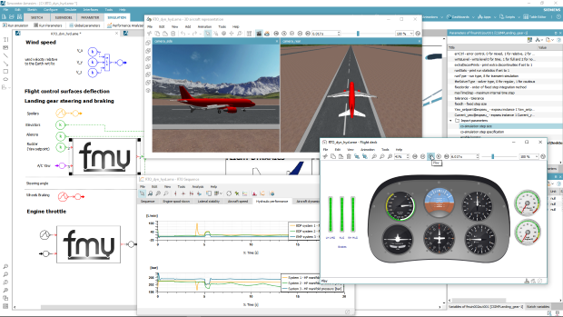

---
title: Siemens PLM Software is proud to announce the release of Simcenter Amesim 16.1
author: "Bruno Loyer ([Siemens PLM Software](http>//www.siemens.com/plm/simcenter-amesim ))"
category: "vendor"
---

#### Simcenter Amesim 16.1 provides a high-quality support of the Functional Mock-up Interface (FMI)

**Simcenter Amesim 16.1**:

* Complies with all existing discrete and continuous FMI 1.0 and 2.0 coupling modes.
* Can be used as master or integration platform for FMUs .
* Can manage multiple instantiations of the same FMU (if supported by the FMU itself).
* Can import and mix multiple FMUs: 1.0, 2.0, model exchange and co-simulation.
* Can export FMUs that support variable-step co-simulation.
* Can automatically generate a standardized HTML documentation for all its exported FMUs.
* Can generate “binary-only” FMUs embedding all the tables they need, for more IP protection and user-friendliness.
* Allows users to fine-tune which parameters and variables to be exposed by exported FMUs. 
* Can export FMUs with both the 32-bit and the 64-bit binaries to ease model sharing via FMI.
* Exports co-simulation FMUs embedding all Simcenter Amesim solver capabilities: through dedicated exposed parameters, one can for instance switch 
  from variable-step to fixed-step solver directly from the importing tool's interface, with no need to re-export the FMU.
* Can export 2.0 FMUs for model exchange or co-simulation that provide their directional derivatives. 
  Thus the recognized frequency analysis capabilities of Simcenter Amesim can be used within advanced master or importing environments. 
* Can directly export “source-code FMUs” for specific FMI compatible multi-core real-time targets, which avoids the use of proprietary middleware 
  to assemble the complete model, or create the real-time application.

**More will come in future releases with other powerful FMI capabilities and usability improvements**.

Stay tuned. For more information on Simcenter Amesim, please visit our [website]( https://www.siemens.com/plm/simcenter-amesim ).
