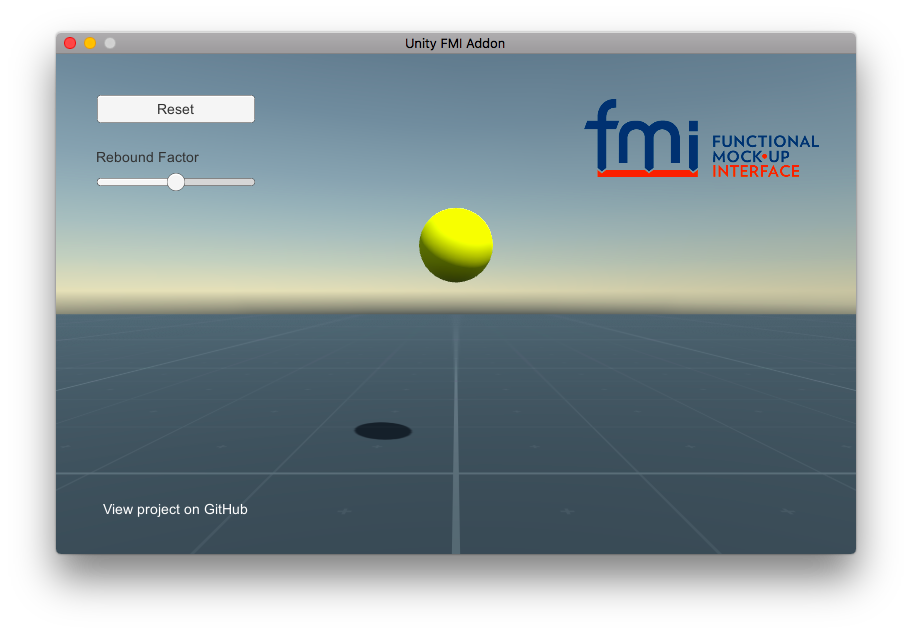

#### Unity FMI Add-on

The Unity FMI Add-on provides a [Functional Mock-up Interface](https://fmi-standard.org/) for [Unity](https://unity3d.com/) and allows users to connect their physical models to Unity games and simulations.

After an FMU has been imported into the Unity project by selecting `Assets > Import FMU` it can be in used in [MonoBehaviour](https://docs.unity3d.com/ScriptReference/MonoBehaviour.html) scripts.

```csharp
public class BouncingBall : MonoBehaviour {

  FMU fmu;

  void Start () {
    fmu = new FMU2("bouncingBall");
    fmu.SetupExperiment(Time.time);
    fmu.EnterInitializationMode();
    fmu.ExitInitializationMode();
  }

  void FixedUpdate() {
    fmu.DoStep(Time.time, Time.deltaTime);
    transform.position = Vector3.up * (float)fmu.GetReal("h");
  }

}
```

A ready-to-run example scene is included that demonstrates how to instantiate and reset a model, set input and get output.



The pre-build player of the `BouncingBall` scene is available as a [download](https://github.com/CATIA-Systems/Unity-FMI-Addon/releases) for Windows and macOS. For more information, downloads and issues visit the [project on GitHub](https://github.com/CATIA-Systems/Unity-FMI-Addon).
