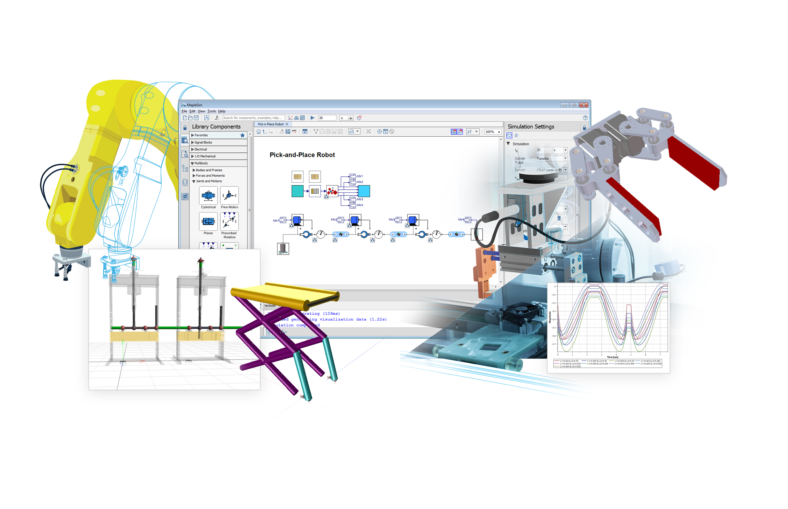

MapleSim 2018 family of products for system-level modeling expands modeling scope and improves toolchain connectivity.

Maplesoft™ has announced a new release of MapleSim™, the advanced system-level modeling tool. From digital twins for virtual commissioning to system-level models for complex engineering design projects, MapleSim helps organizations reduce development risk, lower costs, and enable innovation. The latest release provides new tools for developing digital twins, in addition to greater connectivity with other modeling tools, and expanded modeling scope.

MapleSim is used across a wide variety of applications and industries, including the creation of physics-based digital twins for virtual commissioning. Identifying the optimal motor size required to drive a mechanism is one of the most important goals of simulation with digital twins, and MapleSim 2018 provides tools that make this task easier. The new 1-D Motion Generation App allows engineers to create motion profiles that adhere to defined velocity and acceleration constraints. They can define the desired motion of the joints, and then run the simulation to discover the torques and forces required to create that motion.  This information can then be used to correctly size the motors, ensuring optimum performance at minimal cost.

MapleSim 2018 provides greater toolchain connectivity with the ability to import models from even more software tools.  With the expanded FMI support, engineers can import models defined using FMI 2.0 Fixed-Step Co-Simulation, as well as FMI Model Exchange. Other improvements include enhanced Modelica support for easy access to more 3rd party component libraries inside MapleSim. In addition, the MapleSim Heat Transfer Library from CYBERNET offers improved tools for studying heat transfer effects and preventing overheating, while the MapleSim Hydraulics Library™ from Modelon and MapleSim Pneumatics Library™ from Modelon add-ons can both now take into account temperature effects during simulations.
