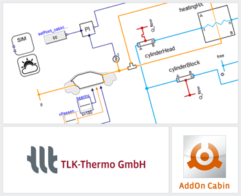

{::options parse_block_html="true" /}

The TIL Suite enables stationary and transient simulations. A new add-on "TIL AddOn Cabin" enriches the model portfolio of TIL:

The Cabin model enables the energy balancing of a cars single air volume and its surrounding components like walls, windows and built-in components. Furthermore, inner and outer thermal effects, the air conveyance separated in fresh and circulated air and the moisture ratio, influenced by the passengers' water production are considered. Besides that, the human energy balance and the comfort level (PMV/PPD) will be calculated, based on a 1-node air cell model.

For further information see [www.tlk-thermo.com](https://www.tlk-thermo.com/index.php/en/software-products/til-suite), [download the TIL presentation](https://www.tlk-thermo.com/images/tlk/content/presentations/TIL_Suite_presentation.pdf) or contact us at [til@tlk-thermo.com](mailto:til@tlk-thermo.com).
