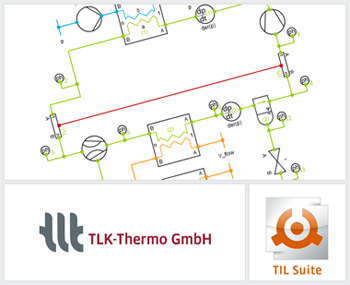

{::options parse_block_html="true" /}

The TIL Suite enables stationary and transient simulations. The current **version 3.5.1** includes new and improved components and system models. Among other things, we would like to draw your attention to the following innovations:
- Two new blocks in Utilitis\Numerics: SmoothSwitch and DiscreteSignalSmoother can be used to get smooth transitions between signals.
- Numerical robustness of almost all valves (Gas, Liquid & VLEFluid) improved.
- Set-point weighting available in PI-Controller, which decouples set-point and feedback acting.

For further information see [www.tlk-thermo.com](https://www.tlk-thermo.com/index.php/en/software-products/til-suite), [download the TIL presentation](https://www.tlk-thermo.com/images/tlk/content/presentations/TIL_Suite_presentation.pdf) or contact us at [til@tlk-thermo.com](mailto:til@tlk-thermo.com).
