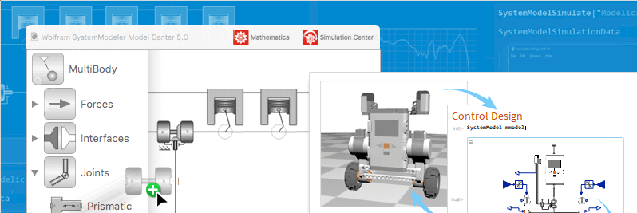

Get an introduction to model analytics with SystemModeler and the Wolfram Language. This free course shows you how to harness the analytics engine of the Wolfram Language to analyze, simulate and generate Modelica models.

You will learn how to use SystemModeler and the Wolfram Language to:

- Get complete control over simulations, such as being able to programmatically specify initial conditions, parameter values and input signal functions
- Create custom plots of variables, such as 3D plots, animations and sensitivity bands, directly from simulation results
- Programmatically create models, either from physical equations or by connecting and configuring models using scripting

[View the course](https://register.gotowebinar.com/register/66586813437067778), or [click here](https://www.wolfram.com/wolfram-u/catalog/modeling-simulation/) to find more Modeling & Simulation courses from Wolfram U.