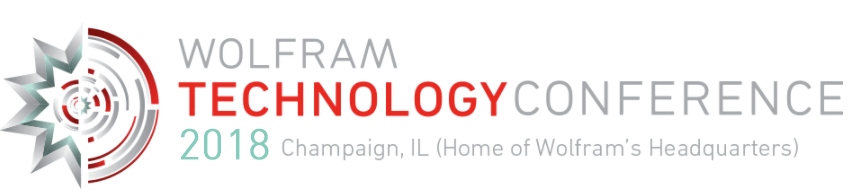

The SystemModeler team will be visiting the Wolfram Technology Conference 2018, come and learn about the latest features in Wolfram SystemModeler and the Wolfram Language.

Other topics include:

- Keep up with the newest tech and best practices in engineering, and explore ways to integrate symbolic-numeric computation, machine learning, visualizations and automated algorithm selection into your workflows [»](https://www.wolfram.com/events/technology-conference/2018/engineering-modeling.html)
- Get hands-on experience in data science, working with industry experts to apply automated machine learning, deep neural networks and advanced human-data interfaces to real-world problems [»](https://www.wolfram.com/events/technology-conference/2018/data-science-ai.html)
- Dive into the latest trends and functionalities in a variety of topical areas, from machine learning to advanced geometry, statistics, chemistry and more [»](https://www.wolfram.com/events/technology-conference/2018/math-science.html)

[Register now](https://www.wolfram.com/events/technology-conference/2018/registration/), or [click here](https://www.wolfram.com/events/technology-conference/2018/) to read more about the event.