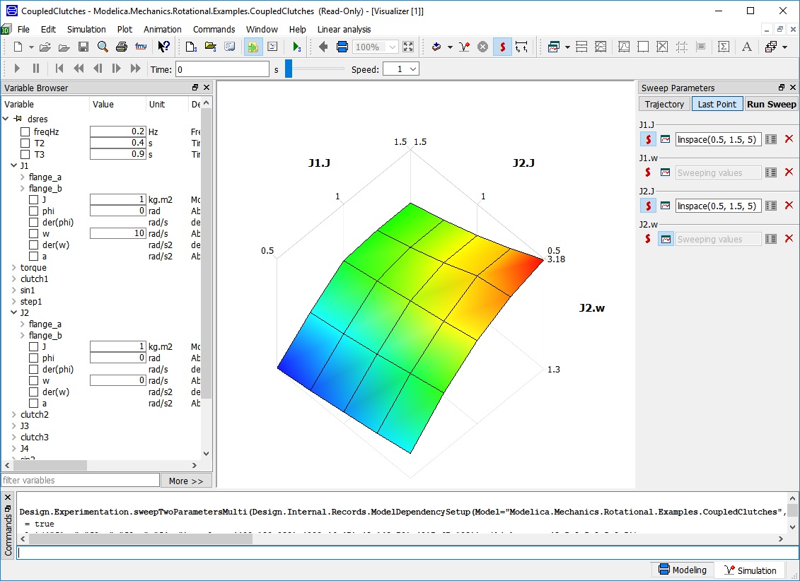

Dymola 2019 FD01 will be released on November 30, 2018.

####Simulation and Experimentation
Experimenting with different parameter settings or initial conditions is one of the most 
common simulation tasks. A new user interface for sweeping parameters makes it easy
to experiment with different parameter settings and plot curves or surfaces to visualize the result.
 
Some models are inherently hard to initialize. Saving start values
after initialization and selection of iteration variables can for certain models 
give more robust handing of difficult equation systems and increase simulation performance.

####Other improvements
To speed up model editing, improved search filters makes searching for models and components easier. This is particularly 
valuable when working with large and complex libraries of models.

Installation of Modelica libraries facilitated by new dialog that unpacks and installs the library where
Dymola can find it. After downloading the library from a server, the user can ask Dymola to display 
the contents in order to select which parts should be installed. After that, Dymola will copy the contents 
into a location where subsequent sessions will find it.

