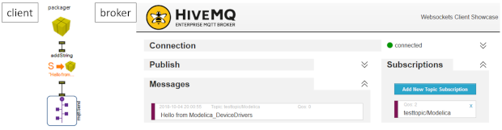

The Modelica device drivers library ([MDD](https://github.com/modelica/Modelica_DeviceDrivers])) is a free library for interfacing hardware drivers to Modelica models. Version v1.6.0, released on Oct 6, is a new main release. It is compatible to MLS v3.3r1 (i.e., no Modelica language features of newer MLS v3.4 are used) and is backwards compatible to the previous MDD v1.5.1. With this latest release the library's license was changed to the new Modelica Association license for libraries: The [3-Clause BSD License](https://modelica.org/licenses/modelica-3-clause-bsd).

The main enhancement is support for MQTT (Message Queuing Telemetry Transport protocol) client communication for IoT  (Internet of Things) messages with following features:
- Wrapper of the Eclipse [Paho](https://www.eclipse.org/paho/) MQTT C client v1.3.0
- Support of (secure TLS encrypted) TCP and Websockets
- Support MQTT v3.1, v3.1.1 and v5.0

Further enhancements include:
- Number of received bytes in UDP receiver is provided as output
- Scalable real-time synchronization
- Utility function to retrieve MAC addresses
- Utility function to generate a UUID

The library is developed at [github.com/modelica/Modelica_DeviceDrivers](https://github.com/modelica/Modelica_DeviceDrivers) where the issue tracker provided by Github can be used to report bugs, feature requests or other issues.
