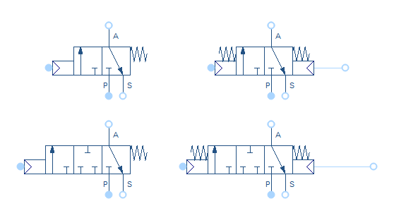
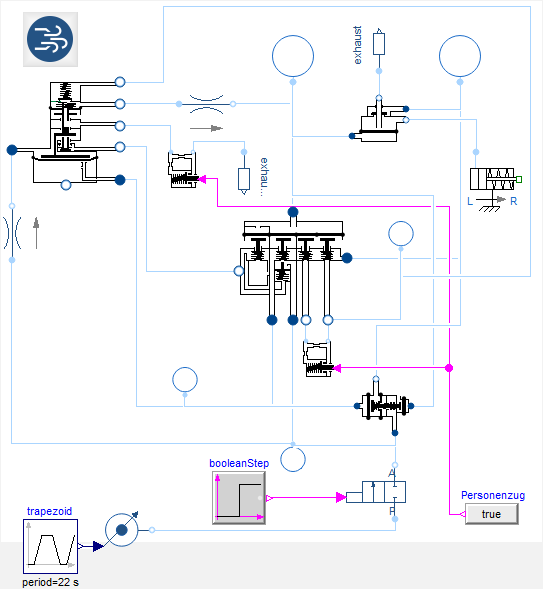

The Pneumatic Systems Library (PSL) is intended to assist the development of pneumatic systems. PSL enables predicting the system behavior for a wide range of industrial applications such as industrial machines, pneumatic brakes or suspension systems
as well as cooling and engine bleed air systems for aerospace.

In this release 1.1, the following improvements and more were made:
- UsersGuide: Documentation for NeglectKineticEnergy.
- Gases: Add a warning for ImportFromMSL when using an incompressible medium.
- Sources: VaneCompressor is now able to start from zero movement.
- Valves: Add V33 valves with a zero flow position between the end positions.
- Actuators: Add preconfigured cylinder setups.
- Piping: Add Fitting component to estimate pressure losses due to flow area changes.
- Sensors: Add VolumeFlowRate and VolumeFlowRateNormalized Sensors.

For further details, please see the UsersGuide.

V33 valves have been introduced to allow a zero mass flow position between the two end positions of the valves. Additionally, for all valves with pneumatic actuation the option to use a reference port has been implemented. It can apply a counter pressure on the actuation pressure.
{:width="558px"}
The newly introduced valves: V33 (bottom) and valves with a reference port (right side).

To demonstrate the application of the PSL for complex models, a pneumatic train brake system has been added to the examples:
{:width="543px"}
This examples covers most of the functional properties of a pneumatic train brake system: A reduction of the train driver brake pressure leads to an increase in the brake pressure. The system is fail-safe as every brake cylinder has it's own pressure reservoir.
