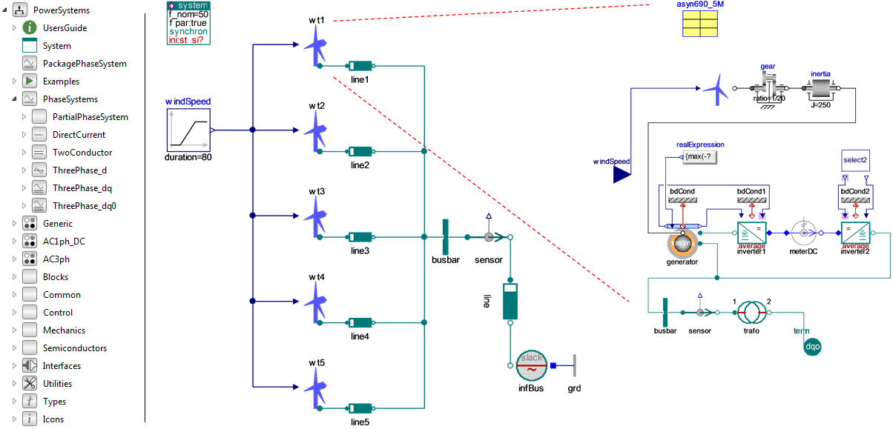

The Modelica PowerSystems library is intended for electrical systems at different levels of detail both in transient and steady-state mode.
The library results from application driven long-term research on Modelica formulations for electrical power systems, carried out within the ITEA projects MODRIO and EUROSYSLIB as well as the RealSim project.
PowerSystems is maintained by Modelica Association and proves useful in today's industrial applications. The applications range from microgrids to high-voltage transmission grids and HVDC.

The figure shows an examplary model of a wind farm with collector grid, zooming into the drive train model of one wind turbine.

Replaceable phase systems are the predominant feature of the library.
This enables different modeling assumptions, resulting in models with different level of detail using one and the same library.
Not only high-fidelity transient three phase models are covered, but also reduced steady-state and DC flow models.

The subpackage Generic contains simple textbook examples that adapt to each phase system.

The subpackages AC3ph and AC1ph_DC contain detailed models of electrical components, such as Breakers, Faults, Impedances, Inverters, Lines, Loads, Machines, Drives, Generation, Shunts and Transformers.
The detailed component models are tailored for specific phase systems and are configured with parameter records.
