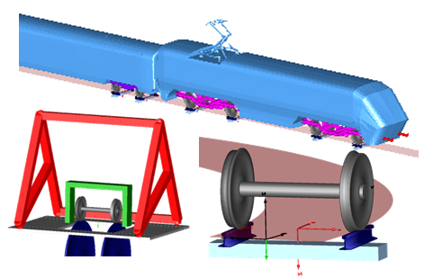

Railway vehicles are complex multibody systems running at high speed along a given track. The particular contact between profiled steel wheels and rails carries the payload, provides lateral guidance and submits traction forces. 
The running gears and their suspensions ensure track-holding and control the vibration comfort, which the passengers perceive. These are the vehicle dynamical issues the new commercial **DLR RailwayDynamics library** is dedicated to.

However moreover, the library proposes a sound modeling framework to support multidisciplinary engineering tasks, which are almost generally given in railway vehicle design.
Pneumatic friction brakes and air suspensions, electrical engines, Diesel-electric or Diesel-hydraulic drive trains are prominent examples and now may be analyzed together with vehicle dynamics in one consistent simulation environment.

On this basis, the intended use of the DLR RailwayDynamics library includes the design, the optimization and control development as well as hardware and software in-the-loop testing mainly on the system level. This is the mission of the [System & Control Innovation Lab](https://www.systemcontrolinnovationlab.de/) at DLR that contributed to the library and offers support to bring associated tasks into service.

The library is now available as a beta-release for interested parties and intended to be commercially distributed after the Modelica Conference 2019.

Contact: Dr. Andreas Heckmann, DLR, Institute of System Dynamics and Control, andreas.heckmann@dlr.de
