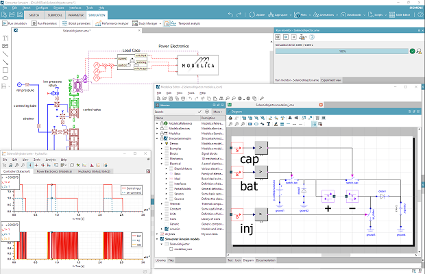

{::options parse_span_html="true" /}

#### Siemens partners with Modelon to use OPTIMICA Compiler Toolkit as its Modelica engine starting of Simcenter&nbsp;Amesim&nbsp;171

**[Siemens](https://www.siemens.com/plm ) and [Modelon](https://www.modelon.com/ ) signed an agreement to integrate Modelon's OPTIMICA Compiler Toolkit (OCT) within Simcenter Amesim**. This agreement will allow [Simcenter Amesim]( https://www.siemens.com/plm/simcenter-amesim ) users to **develop**, enhance and reuse Modelica libraries to describe dynamic multi-physical systems, and **combine** them seamlessly with Simcenter Amesim **native** libraries.  
Such a model will benefit from the **full support of the Modelica standard** and **optimized code** generated by [OCT](https://www.modelon.com/products-services/modelon-creator-suite/optimica-compiler-toolkit ), and will be simulated by the **Simcenter Amesim** solver while being **compatible** with noticeable **Simcenter Amesim platform capabilities** such as Performance Analyzer or Linear Analysis.  
The support of [Modelon's industrial libraries](https://www.modelon.com/products-services/modelon-library-suite/ ) through this workflow will come in future releases. 

“Do not choose between *causal* and *acausal* approaches: **enjoy the best of both worlds within the same environment!**”

\[1\]: Available upon request in Simcenter&nbsp;Amesim&nbsp;17.
  
For more information on Simcenter Amesim, please visit our [website]( https://www.siemens.com/plm/simcenter-amesim ).
