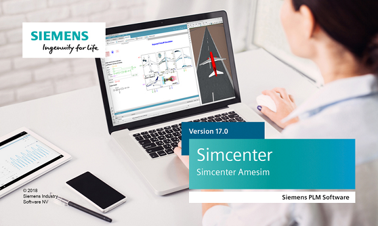

[Siemens PLM Software](https://www.siemens.com/plm ) is proud to announce the recent release of [Simcenter Amesim 17](https://youtu.be/C4mzd3Ptf0Q ). 
In this release, major development efforts have been put to help address key applications for electrification, controls engineering, vehicle systems and components performance engineering, aircraft systems performance engineering, and interoperability.

#### Extended Modelica language support 
Thanks to the partnership established between [Siemens](https://www.siemens.com/plm ) and [Modelon](https://www.modelon.com/ ), [Modelon's OPTIMICA Compiler Toolkit](https://www.modelon.com/products-services/modelon-creator-suite/optimica-compiler-toolkit ) can be used 
to create and/or include Modelica models within your native Simcenter Amesim models. This functionality is available upon request with
Simcenter Amesim 17 and will be delivered as standard in the forthcoming release (expected in April 2019). 

#### More FMI improvements

Simcenter Amesim 17 introduces four new FMI capabilities: 

* **More user-friendly run parameters for co-simulation FMUs**: some rework has been made on the way run parameters (typically solver settings) are exposed by Simcenter Amesim co-simulation FMUs. Now, these parameters are always relevant, self-explaining and mapped to standard FMI enumerations whenever possible.
* **Structured naming convention at FMU import**: when imported into Simcenter Amesim, FMUs using the structured naming convention (dotted names) get their parameters and variables now presented in a convenient and hierarchized tree view.
* **Structured naming convention at FMU export**: like Modelica FMUs for instance, Simcenter Amesim FMUs are now exported using the FMI structured naming convention. This is more convenient within importing environments that leverage structured parameter and variable names.
* **Tunable parameters for FMI 2.0 export/slave**: exporting Simcenter Amesim 2.0 FMUs with tunable parameters is now possible. This can be used for controls calibration on compatible real-time targets such as dSPACE SCALEXIO.
Another use case consists in switching between various mission profiles (chained maneuvers) in a Hardware-in-the-Loop context with no need to restart the model.

More will come in the next release, along with tunable parameters extended to components from various libraries. 
Virtual calibration directly within the Simcenter Amesim environment through interactive dashboards will also be made possible. Stay… tuned!

For more information on Simcenter Amesim, please visit our [website]( https://www.siemens.com/plm/simcenter-amesim ).
