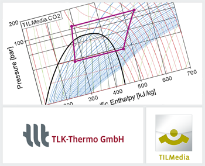

{::options parse_block_html="true" /}

The TILMedia Suite provides methods of calculation, which express the thermophysical properties of incompressible liquids, ideal gases and real fluids containing a vapor liquid equilibrium. Among other things, we would like to draw your attention to the following innovations in the current **version 3.6.0**:
- New Liquid TILMedia.Novec7500: '3M&trade; Novec&trade; 7500 Engineered Fluid'.
- New TILMedia Java interface for Windows.
- Introduced base classes in Modelica.
- Added new medium class in Modelica

For further information see [www.tlk-thermo.com](https://www.tlk-thermo.com/index.php/en/software-products/tilmedia-suite), [download the TILMedia presentation](https://www.tlk-thermo.com/images/tlk/content/presentations/TILMedia_EN_2017_December.pdf) or contact us at [tilmedia@tlk-thermo.com](mailto:tilmedia@tlk-thermo.com).
