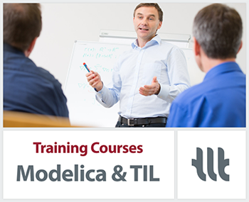

{::options parse_block_html="true" /}

TLK-Thermo offers two day Modelica training courses for learning basic and advanced object oriented modeling. The Modelica course is an introduction to the most important features of Modelica, including numerical aspects. With many practical exercises the participants will learn how to design and implement Modelica libraries (not only within thermal science).

Furthermore, we are offering a one day course for thermal system modeling with the Modelica library TIL. The training course is directed towards simulation and modeling specialists with basic knowledge of the Modelica programming language. It can be seen as an advanced course to the basic Modelica training.

The next training course will take place in Braunschweig on 22nd to 24th of January, 2019.

For further Information regarding our courses see [TLK-Thermo training courses](https://www.tlk-thermo.com/index.php/en/services/training) or contact us at [training@tlk-thermo.com](mailto:training@tlk-thermo.com).
