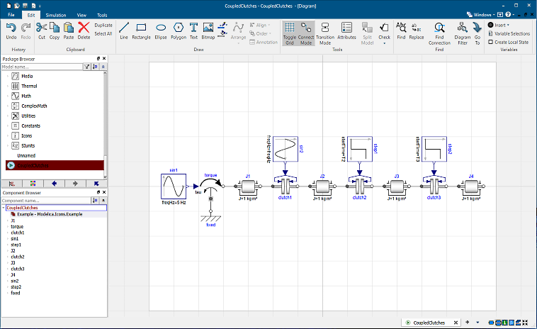

The user interface of Dymola has not changed much for several years, but now it’s time for a major overhaul. 
Dassault Systèmes is working on a new ribbon-based user interface that both looks more modern and is more
task-focused to increase productivity. Development is in full progress, and we seek test pilots for the first
beta-release in May this year. The core of the beta-version will be compatible with Dymola 2020.

If you are interested in becoming one of the early test pilots, please contact Dag Brück (dag.bruck@3ds.com). 

