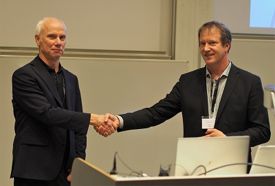
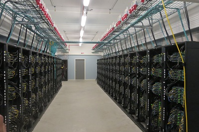

The 13th international MODPROD Workshop on Model-Based Cyber-Physical Product Development, organized by the MODPROD competence center at Linköping University, was successfully held at Linköping University, Linköping, Sweden, February 5-6, 2019.
Three tutorials were held in the morning the first day on the topics: Introduction to Modelica modeling, debugging, and Julia interoperability; FMI for composite modeling, co-simulation and model-exchange; Modeling software processes and practices with the ESSENCE standard. 

The following keynotes were presented:

Lars Ydreskog, Deputy CEO, Combitech, Sweden. ”Model-Based Systems Engineering, an Enabler for Digital Product Creation
Henrik Lönn, Technology Specialist, Embedded Software, AB Volvo. ”Model Based Continuous Integration of Automotive Embedded Systems”
Charlotta Johnsson, Professor, Department of Automatic Control, Lund University. ”International Standards and their Relevance for Model-Based Development”

The program and the presentations are available from [modprod program](www.modprod.liu.se)

  

Left:Peter Fritzson (Linköping University) (left) leaves as MODPROD director after 13 years, becomes vice director, and hands over the directorship to Niclas Fock (RISE Research Institutes of Sweden).  

Right:Visit to the National Supercomputer Center in Linköping (www.nsc.liu.se ) where the new supercomputer TetraLith has just been installed.