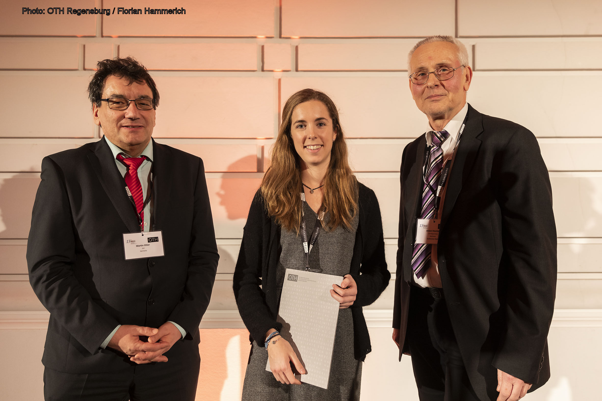

The **13th International Modelica Conference** has been held at **OTH Regensburg, Germany, March 4-6, 2019**. 
It has been organized by OTH Regensburg / Faculty of Electrical Engineering and Information Technology, in cooperation with the Modelica Association.

Prof. Wolfgang Baier, President of OTH Regensburg welcomed the participants.

#### Conference Venue
The conference took place at Ostbayerische Technische Hochschule (Eastbavarian Technical University) Regensburg near the center of Regensburg, 
only 30 minutes to walk from the historical centre of Regensburg.    
**Venue Address**: OTH Regensburg    
Seybothstr. 2, 93053 Regensburg, Germany

#### Welcome
The **Modelica Conference** is the main event for users, library developers, tool vendors and language designers to share their knowledge 
and learn about the latest scientific and industrial progress related to Modelica and to the Functional Mockup Interface.
The program will cover modeling of complex physical and cyber-physical systems, as well as tools, for a wide range of research and industrial applications. 
In addition to paper presentations and poster sessions, the conference features several Modelica tutorials for beginners and advanced users, as well as vendor presentations, and an exhibition. 

Starting with this conference, you will notice some changes: 

First, we are going to organize the International Modelica Conference every two years in spring. 
In the years between International Modelica Conferences, Modelica Conferences are organized on other continents with country specific focus.

Second, additional to the tutorials and vendor presentations on the first day of the conference, 
we are going to have Industrial User Presentations related to the Modelica Association Projects. 
These presentations are not included in the proceedings, but they should provide a nucleus for discussions and broadening the users groups.

#### Facts:
- 2 sessions with industrial user presentations
- 7 tutorials
- 14 vendor presentations
- 17 sponsors and exhbitors
- 101 submissions, 76 oral presentations and 13 posters
- 2 keynotes held by Dr. Chistian Kral, Vienna and Dr. Gerd R&ouml;sel, Continental Regensburg
- 320 attendees / 570 together with American and Japanese Modelica Conference within 10 months!
- Proceedings available at the [Modelica Website](https://modelica.org/events/modelica2019/subpages/modelica-conference-2019-proceedings) and [Link&ouml;ping University Electronic Press](http://www.ep.liu.se/ecp/contents.asp?issue=157)

#### Modelica Library Award
We proudly announce the winners of the Modelica Library Award 2019:

The first price was awarded to Queralt Altes-Buch and her co-authors for her submission [**Greenhouses**: A Modelica Library for the Simulation of Greenhouse Climate and Energy Systems](https://modelica.org/events/modelica2019/proceedings/html/papers/Modelica2019paper5A2.pdf)

The second price was awarded to Christian Kral and his co-authors for his submission [Open Source **PhotoVoltaics** Library for Systemic Investigations](https://modelica.org/events/modelica2019/proceedings/html/papers/Modelica2019paper1B1.pdf)

We encourage **you** to submit your work for the Library Award at the next Modelica Conference!

#### Conference Board
- Prof. Anton Haumer, OTH Regensburg (Conference Chair)
- Prof. Francesco Casella, Politecnico di Milano, Italy
- Dr. Hilding Elmqvist, Mogram, Lund, Sweden
- Prof. Peter Fritzson, Link&ouml;ping University, Sweden
- Prof. Martin Otter, DLR, Germany
- Dr. Michael Tiller, Xogeny, Michigan, USA

**Many thanks to all that supported the conference!**
**Thank you all for coming - hope to meet you at the next conference!**

#### Contact
Prof. Anton Haumer, OTH Regensburg (Conference Chair)    
**In case of questions, please send an email to**: modelica2019@modelica.org

