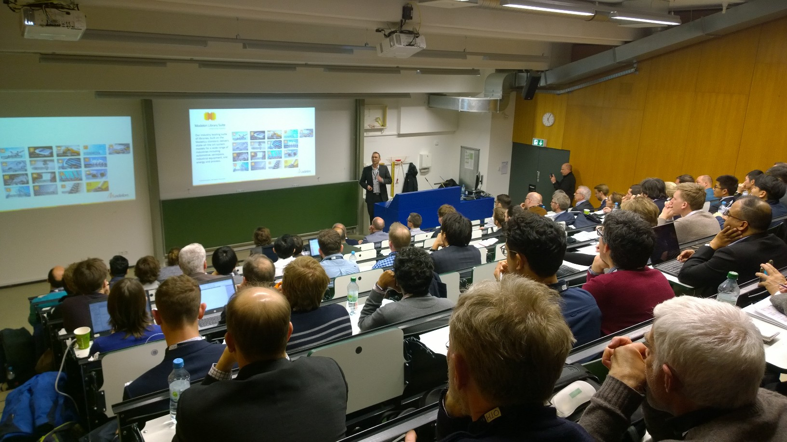

Modelon provides software solutions and expert services to organizations that use model-based simulation tools to design and develop technical systems. Modelon’s [libraries](https://www.modelon.com/products-services/modelon-library-suite/), [solver](https://www.modelon.com/products-services/modelon-creator-suite/),and [deployment solutions](https://www.modelon.com/products-services/modelon-deployment-suite/) are leading products available in the market today for modeling, simulation, and optimization. Our products enable companies to focus on delivering a unified picture of product system interaction and performance - from product concept to operation. 

Visit www.modelon.com for more information. 

Follow us on [LinkedIn.](https://www.linkedin.com/company/modelon)

### Now Available: Modelon Authored Papers from the 13th International Modelica Conference

Thank you to everyone who attended Modelon's vendor session, paper presentations, and visited the Modelon booth at the 13th International Modelica Conference. Proceedings from the following presentations are now available:

##### Model-Based Controls Development and Implementation for Hydroelectric Power System
*By Authors Anh Nguyen and John Batteh*

This paper describes the model-based control system development for a hydroelectric power plant to ensure water level control and mitigate spillage risk.  The modeling of both the flume system and prototype controls is described.  The integrated model is run over a suite of tests to verify the calibration of the control strategy.  Results from the plant commissioning are compared with the virtual tests.  The model proved capable of accurate predictions of the waterway dynamics, and the model-based calibration was successfully verified on the actual plant. 

[Read the full publication here.](https://www.modelica.org/events/modelica2019/proceedings/html/papers/Modelica2019paper4A3.pdf)

##### Diesel Cooling System Modeling for Electrification Potential
*By Authors John Batteh, Ashok Kumar Ravi, and Dale Pickelman*

Electrification of automotive systems presents significant opportunities for improvements in cooling system efficiency and performance.  This paper describes an effort to develop an analytic platform for Hanon Systems to evaluate the electrification potential for powertrain cooling systems.  The paper describes the development of a baseline diesel cooling system model based on the Ford 6.7L Power Stroke diesel. A variant of the system with electric pumps is also modeled.  Performance of the baseline conventional and electric pump system are compared on a typical automotive drive cycle to quantify potential benefits of the electric pump system and advanced controls. 

[Read the full publication here.](https://www.modelica.org/events/modelica2019/proceedings/html/papers/Modelica2019paper1D3.pdf) 

### On-Demand Webinar: Integrating Carbon Capture & Storage Technology Using Simulation

In this free webinar, Modelon teams up with researchers from the Norwegian University of Science and Technology (NTNU) to explore Carbon Capture and Storage technology for reducing powerplant emission levels by up to 90%. Our presenters walk through their study of building a scalable plant model with Modelon’s [Thermal Power Library](https://www.modelon.com/library/thermal-power-library/), using data from a large-scale pilot plant to validate their model, designing control structures, and effectively integrating Carbon Capture & Storage (CCS) technology with a flexible operation plant.  [Watch the webinar now.](https://www.modelon.com/support/webinar-integrating-carbon-capture-storage-technology-using-simulation/)  

### New Blog: Propagating Replaceable Medium Automatically

Users of Modelon libraries in Dymola can activate a new feature that will automatically update the Medium in each component. Learn how to implement this new feature in our recent tips and tricks blog. 

[Read the blog.](https://www.modelon.com/propagating-replaceable-medium-automatically/)

