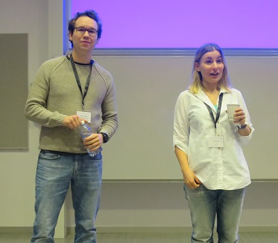
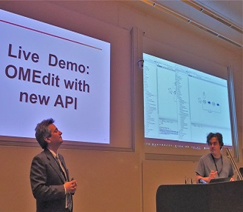

The 11th OpenModelica Annual Workshop organized by the Open Source Modelica Consortium was held successfully in Linköping, Sweden, on February 4, 2019.
New results and applications regarding the OpenModelica platform were presented, including the new fast OpenModelica compiler frontend, vectorized applications for digital platforms, unified simulation interface, FPGA simulations, initialization with dynamic state selection, simulation for an X-ray space observatory, OpenModelica technical overview, unit testing, OMSimulator 2.0 for FMI simulation, teaching Modelica using OpenModelica.

The program and the 13 presentations are available from [Workshop Program](https://www.openmodelica.org/events/openmodelica-workshop/openmodelica-program-2019)

  

Left:Lennart Ochel and Lena Buffoni, OpenModelica workshop chairpersons (Linköping University) opening the workshop. 

Right:OpenModelica workshop, Francesco Casella and Adrian Pop making a live demo of OMEdit with the new frontend based API with an impressive 20x faster performance.
