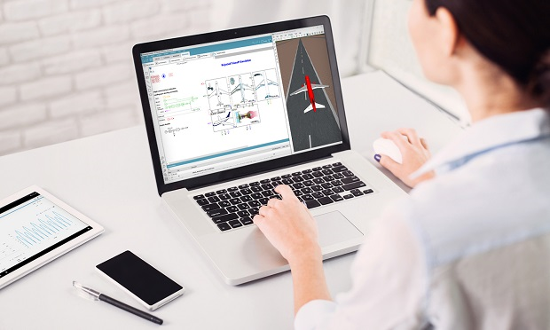

#### Modelon – Siemens partnership: outcome reflected in the shortly available version of Simcenter&nbsp;Amesim
As a result of the previously announced partnership between [Siemens](https://www.siemens.com/plm ) and [Modelon](https://www.modelon.com/ ), Siemens confirms that the forthcoming release of **Simcenter&nbsp;Amesim** (expected April 2019) will be the first version to officially include [Modelon's OPTIMICA Compiler Toolkit](https://www.modelon.com/products-services/modelon-creator-suite/optimica-compiler-toolkit ) as its standard Modelica engine to create and/or reuse Modelica models within native **Simcenter&nbsp;Amesim** models. Thanks to this revamped Modelica support, it will be possible to combine the strengths of causal and acausal modeling techniques within a unique platform. 

#### FMI still at the core of Siemens' product strategy

As since day one, [Siemens PLM Software](https://www.siemens.com/plm ) contributes to the FMI 3.0 specification and more generally to the promotion of the FMI standard to its industrial customers. In this spirit, the next release of **Simcenter&nbsp;Amesim** will bring many improvements to the FMI support. In short, these enhanced capabilities will allow for:
* the use of **additional advanced co-simulation techniques**,
* an **increased protection of the intellectual property contained in Simcenter&nbsp;Amesim FMUs**,
* performing the **virtual calibration of imported FMUs** directly within the **Simcenter&nbsp;Amesim** GUI.

Moreover, users will be able to export their **Simcenter&nbsp;Amesim** multiphysical models to **additional FMI compatible real-time targets**. These new capabilities will serve the needs of both the “traditional” automotive and aerospace industries as well as the emerging&mdash;and exciting&mdash;applications of **the Industrial Internet of Things (IIoT)**, in total coherence with **the Industry 4.0 vision embodied by Siemens**.   

Stay tuned for our official launch press release, to be published in the coming days. In the meantime and for more information on **Simcenter&nbsp;Amesim**, do not hesitate to visit our [website]( https://www.siemens.com/plm/simcenter-amesim ).
