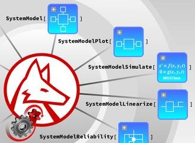

*Mathematica and SystemModeler 12.0 will be released during spring 2019.*

Version 12.0 of **Mathematica** comes with built-in simulation engine of SystemModeler. This means millions of Wolfram language users world-wide can simulate, model and analyze any Modelica model and make use of all the system modeling functionality. 

Integration with the Wolfram language makes it easier to perform complex tasks such as:
- Designing and optimizing components of a system, e.g. designing guidance system of a rocket
- Obtaining real-world data, e.g. comparing energy consumption for house heating
- Creating custom visualization, e.g. visualizing a satellite path

The latest version of **SystemModeler** contains many new features to make your design process more efficient. Some of the significant features are:
- *Symbolic Linearization*–Linearize your model symbolically around any operating point and use it for your study of dynamical systems.
- *Equation Browser*–Debug your models, understand simulation behavior and eliminate performance bottlenecks with the equation browser.
- *Full FMI support*–Share models with any other FMI compliant tool for further analysis such as software-in-the-loop testing, CFD analysis and more.

[Click here](http://www.wolfram.com/system-modeler/what-is-new) to read the latest SystemModeler news.
