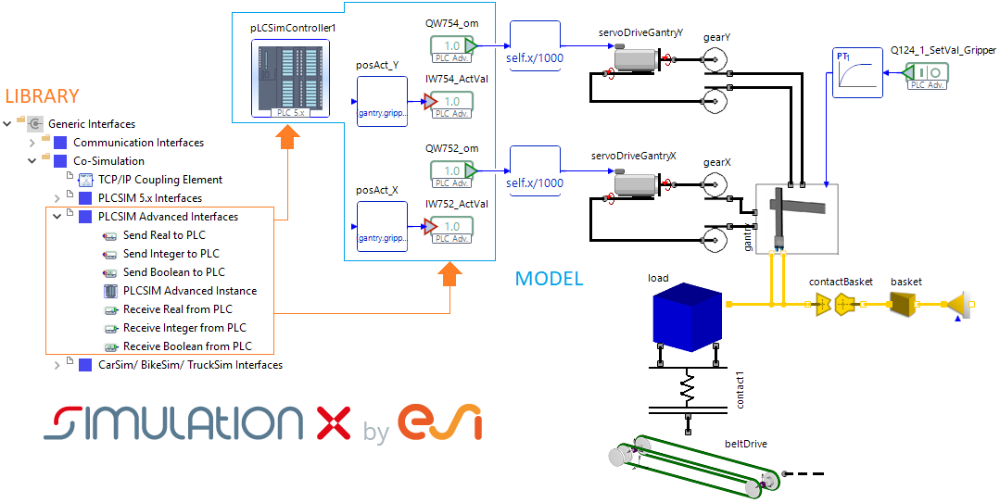

The new Modelica Co-Simulation library **PLCSIM Advanced Interfaces** as part of the Modelica library *Generic Interfaces* for SimulationX allows for Co-Simulation between SimulationX and the Siemens software *PLCSIM Advanced*.
This enables you to run Software-in-the-Loop tests (SiL) of a controller simulated in *PLCSIM Advanced* by Siemens and the automation object simulated in SimulationX.
One of the advantages of SiL is that the test is based on fully virtualized system components
and can therefore be performed before the procurement and construction of the same. 
The Co-simulation partners work on a virtual time basis so that the simulation is no longer carried out in real time making the requirements for real-time capable models obsolete.
Simply connect your Modelica model with the corresponding Co-simulation interface elements and start your SiL test.

(Siemens® is a registered trademark and *PLCSIM Advanced* a product of SIEMENS AG)
