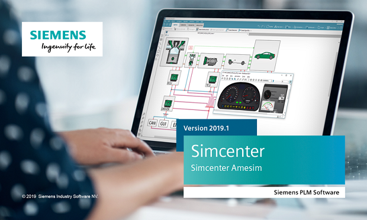

#### Revamped Modelica support in Simcenter&nbsp;Amesim&nbsp;2019.1
Check out the first outcomes of the **Siemens-Modelon partnership** reflected in **Simcenter&nbsp;Amesim&nbsp;2019.1**, the first release to officially include **Modelon's 
Optimica Compiler Toolkit [(OCT)](https://www.modelon.com/products-services/modelon-creator-suite/optimica-compiler-toolkit )** as Modelica engine. Please take a look at our [blog post](https://community.plm.automation.siemens.com/t5/Simcenter-Blog/Simcenter-Amesim-Modelica-it-s-a-match/ba-p/606047) for more info. 

#### New FMI capabilities in the recently released Simcenter&nbsp;Amesim&nbsp;2019.1

The recently released **Simcenter&nbsp;Amesim&nbsp;2019.1** has brought new enhancements to the support 
of the FMI standard, both in terms of usability and advanced capabilities. As always, 
these improvements are dedicated to serving the needs of our industrial users. 
The most noticeable functionalities are listed hereafter:

* **Simcenter&nbsp;Amesim co-simulation FMUs now comply with master algorithms 
that perform polynomial extrapolation on slaves' inputs**, which provides speed-up on specific models within advanced co-simulation environments. 
* **Models containing encrypted supercomponents can now be exported as FMUs** 
to be safely shared with partners and used within third-party FMI compatible tools.
* **The virtual calibration of imported 2.0 FMUs is now possible**, thanks to the management of **FMI tunable parameters** directly within the **Simcenter&nbsp;Amesim** GUI.
* **Simcenter&nbsp;Amesim** real-time capable models can be exported as **co-simulation FMUs specifically generated for [FEV xMOD](https://xmod.fev.com/)** test benches, typically to address Hardware-in-the-Loop / Engine-in-the-Loop use cases. 
* **Simcenter&nbsp;Amesim** real-time capable models can also be exported as **“source-code FMUs” usable on [Siemens SIMATIC Edge Computing platforms](https://new.siemens.com/global/en/products/automation/topic-areas/industrial-edge.html)**, to cover high-end **Industrial Internet of Things (IIOT) applications**.  

[Siemens PLM Software](https://www.siemens.com/plm ), as active member of the FMI Steering Committee contributes to the FMI 3.0 specification and more generally to the promotion of the FMI standard to its industrial customers. 
For more information on **Simcenter&nbsp;Amesim**, do not hesitate to visit our [website]( https://www.siemens.com/plm/simcenter-amesim ).
