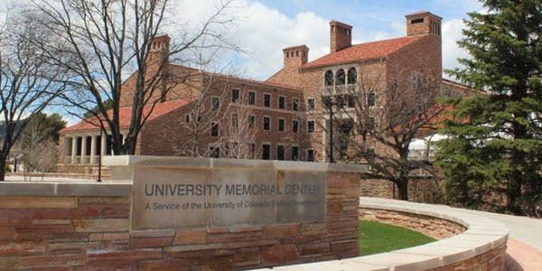

# American Modelica Conference 2020

The next American Modelica Conference will be held in Boulder, Colorado (USA) at the University of Colorado, Boulder.

The conference will be held in the University Memorial Center at 1669 Euclid Ave, Boulder, CO 80309.  The conference will
take place from March 23rd to March 25th.

As with previous years,
the first day of the event will consist of workshops that are free to attend.  The remaining days will require a ticket and will
feature vendor sessions and presentations.

The Call for Papers is [now available](https://modelica.org/events/modelica2020Americas/call-for-papers) and
additional information will be posted to [modelica.org](https://modelica.org) as it
becomes available.

Registration and tickets are being handled through [the conference's EventBrite page](https://amc2020.eventbrite.com).

We look forward to the many fine submissions and engaged attendees that have characterized this event through the years.
