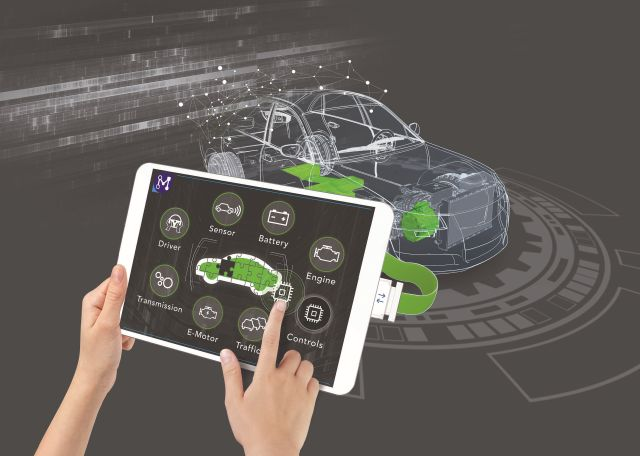

Model.CONNECT is AVL’s co-simulation and integration platform with built-in interfaces to all
the FMI standards and the leading 3rd party simulation tools and user’s code. With its patented
technologies for co-simulation error elimination (NEPCE) and RT/nonRT model synchronization
(ACORTA), Model.CONNECT enables connection of simulation models with HiL and hardware
testing environments.
In the new release 2019 R1 due in early April, Model.CONNECT comes out with an integrated
FMU creation tool fmi.LAB which turns Simulink controls models into FMUs, exposing
thousands of scalar and tables via standard XCP bridge to the leading calibration tools such as
INCA, CANape, AVL Concerto etc. With this feature Model.CONNECT closes the gap in usage
of softECUs in a virtual calibration process
