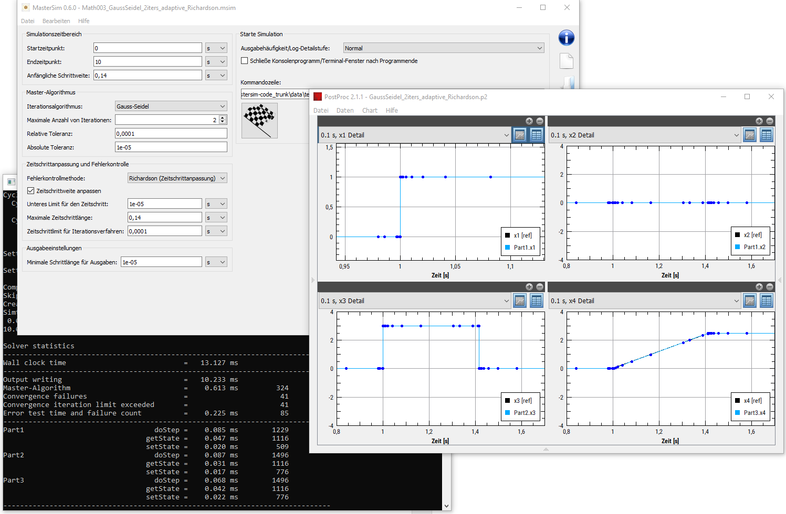

The co-simulation master tool MasterSim ([https://bauklimatik-dresden.de/mastersim]), 
has reached a new important milestone. The open-source development aims at creating a 
reference implementation, that gives developers of master tools and FMI slaves as 
transparant piece of code to check and optimize their own implementations. 
For that purpose it implements most modern co-simulation coupling algorithms 
(Gauss-Jacobi, Gauss-Seidel, Newton) and supports FMI standards 1 and 2, the 
rollback-feature of the latter being used for the iterative algorithms. As C/C++ implementation, 
it is implemented with performance in mind (performance evaluators are welcome to compare it to 
other simulation engines). The code is hosted on 
[https://sourceforge.net/projects/mastersim], which also includes the documentation (wiki-pages). 
The simulation engine is complemented by the equally free post-processing software PostProc 2 
([https://bauklimatik-dresden.de/postproc]).

