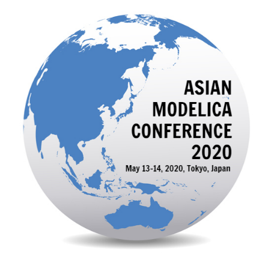

Previously known as the Japanese Modelica Conference, the Asian Modelica Conference 2020, will be held at Nihonbashi Takashimaya Mitsui Building, Tokyo, Japan from May 13–14, 2020.

The Call for Papers is now available and the deadline for submission is January 31, 2020. For guidelines on paper submissions review the [conference website, here](https://2020.asian.conference.modelica.org/).

This conference is organized by [Modelon](https://www.modelon.com/) in cooperation with the [Modelica Association](https://www.modelica.org/).
