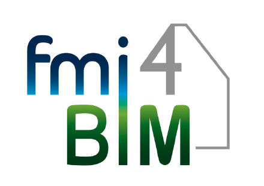

The project focuses on improving co-simulation technology for coupled simulation of indoor climate, HVAC systems and their controllers with the goal to enhance the energy performance of buildings. Simulation results can help to improve design and operation of buildings. Yet, first the obstacles for every day use in the design process need to be adressed.

The FMI4BIM project will improve existing models of indoor climate, HVAC systems and their controllers with special respect to coupling via the well established FMI standard.
Currently model generation is a cumbersome task. Different actors are creating different models for different issues using different datasets and interfaces, therefore reuse is hardly possible. FMI4BIM will push forward the application of existing models from the BIM based design workflow for Building Energy Performance simulation by analyzing and harmonizing them.
Goal of the project is a solution applicable for the design engineer. The projects will thus contribute to the digitalization in the building sector.

The project has started in January 2019 and will end by December 2021.
Project partners are:

- ESI ITI GmbH: software vendor of SimulationX
- EA Systems Dresden GmbH: building simulation consultants and developers of the GreenCityLibrary
- Innius GTD GmbH: MEP consultants
- Fraunhofer IIS/EAS Institute for Integrated Circuits, Division Engineering of Adaptive Systems
- Technische Universität Dresden - Institute of Building Climatology
