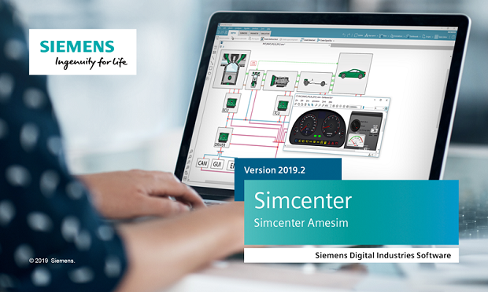

[Siemens Digital Industries Software](https://www.sw.siemens.com/ ) is proud to announce the recent release of [Simcenter Amesim 2019.2](https://youtu.be/o7iZYtLF1a0 ). 
Among the key features introduced in this release, we can highlight two neural network related capabilities:

* **The Neural Network Builder tool** that allows to create CPU-efficient dynamical non-linear surrogate models, based on time series generated with detailed Simcenter Amesim models. These surrogate models can then be reused as Simcenter Amesim components for speed-up and/or model reduction purposes. They can also be exported as [ONNX](https://onnx.ai/ ) files.
* **The Neural Network Import tool** that enables the import of pretrained neural networks or other machine learning algorithms described as [ONNX](https://onnx.ai/ ) files into Simcenter Amesim. 

The neural network components coming from Simcenter Amesim itself or from other [ONNX](https://onnx.ai/ ) compatible software can then be exported as 1.0 or 2.0 FMUs for co-simulation or model exchange. 

#### Extended Modelica language support 
The version of [Modelon's OPTIMICA Compiler Toolkit](https://www.modelon.com/products-services/modelon-creator-suite/optimica-compiler-toolkit ) used to create and/or include Modelica models within your native Simcenter Amesim models has been upgraded to version 1.12.6, providing increased stability and compatibility to Modelica users. Recognized open-source libraries such as [BuildingSystems](https://modelica-buildingsystems.de/ ) and [Buildings](https://simulationresearch.lbl.gov/modelica/ ) have been successfully tested in Simcenter&nbsp;Amesim&nbsp;2019.2 in their latest versions.    

#### Export of hybrid models as FMUs

Under Windows or Linux, Simcenter Amesim models containing Modelica or Simulink models can now be seamlessly exported as FMUs with a fully automated management of FMU internal resources.
The same goes for statecharts and the neural network models created with the **Neural Network Builder** or imported with the **Neural Network Import** (as mentioned above). These models can additionally be exported *via* “source-code FMUs” to FMI compatible real-time targets such as dSPACE&nbsp;SCALEXIO, FEV&nbsp;xMOD, ETAS&nbsp;LABCAR or Concurrent SIMulation&nbsp;WorkBench.

For more information on Simcenter Amesim, please visit our [website](https://www.plm.automation.siemens.com/global/en/products/simcenter/simcenter-amesim.html ).
